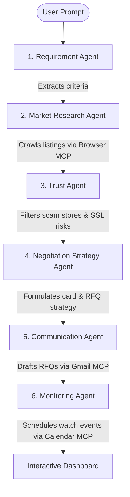

# DealPilot AI ✈️
### Multi-Agent Retail Price Negotiator & Continuous Monitoring Concierge Agent
*Built as a Capstone Submission for Kaggle's 5-Day AI Agents: Intensive Vibe Coding Hackathon (Google DeepMind)*

DealPilot AI is an autonomous, privacy-centric concierge agent designed to find, watch, and negotiate the best consumer deals. Instead of simply generating web links, DealPilot AI crawls online markets, screens out suspect listings, maps credit card discounts, and **initiates direct competition** by drafting RFQ (Request for Quotation) price-matching emails to local authorized brick-and-mortar dealers. 

---

## 📌 Submission Overview
* **Track:** **Concierge Agents** (or **Freestyle**)
* **Core Technologies:** Multi-Agent System (ADK), Model Context Protocol (MCP) Servers, Gemini LLMs, Glassmorphic HTML5/CSS3/JS Console.
* **Core Concepts Demonstrated:**
  1. **Multi-Agent System (ADK):** 6 specialized agents coordinating price discovery and negotiations.
  2. **MCP Server Integration:** Integrates Gmail, Calendar, Browser, and Workspace Filesystem servers.
  3. **Security Features:** Sandboxed permissions, user consent popups, draft-only Gmail access, and zero tracking of sensitive documents (No Aadhaar, PAN, or bank credentials).
  4. **Continuous Monitoring:** Time-series price dropping timeline matching card promotions.

---

## 🏗️ Multi-Agent Architecture Design

DealPilot AI splits complex reasoning, security vetting, and communication tasks across six cooperative, sandboxed agent modules:



### The 6-Agent Breakdown
1. **Requirement Agent:** Parses unstructured user queries (e.g. product, location, budget, credit cards, urgency) into structured JSON schema parameters using Pydantic and Gemini.
2. **Market Research Agent:** Crawls and index baseline pricing from e-commerce platforms (Amazon, Flipkart, Reliance Digital, Croma) by calling Browser MCP search tools.
3. **Trust Agent:** Enforces security guardrails. Rejects unsecured endpoints (no SSL) and stores with poor seller ratings (<3.5/5).
4. **Negotiation Strategy Agent:** Reviews card schemes and initiates local store price-match competitions by structuring draft inquiries (RFQs) if the price baseline exceeds the budget.
5. **Communication Agent:** Generates custom email templates. Uses the Gmail MCP Server to create drafts in the user's outbox.
6. **Monitoring Agent:** Sets up price check alerts and schedules purchase reminders using the Calendar MCP Server.

---

## 🔒 Security & Privacy Vitals
Concierge agents must keep personal data safe. DealPilot AI enforces strict security policies:
* **No PII Collection:** The agent never requests or logs government IDs (Aadhaar, PAN), medical data, or bank credentials.
* **Consent-First Communication:** Gmail integrations operate in **Draft-Only Mode**. The agent creates email drafts in your outbox; emails are never sent without explicit manual verification.
* **Vetted Merchant Registry:** Trust Agent blocks fraudulent domains.

---

## 📂 Project Structure
```
├── backend/
│   ├── agents/
│   │   ├── __init__.py
│   │   ├── requirement_agent.py   # Pydantic extraction via Gemini 2.5
│   │   ├── research_agent.py      # Online crawler emulator
│   │   ├── trust_agent.py         # SSL & merchant safety filter
│   │   ├── strategy_agent.py      # Coupon & RFQ planner
│   │   ├── communication_agent.py # Gmail MCP draft creator
│   │   └── monitoring_agent.py    # Calendar watch scheduler
│   ├── main.py                    # Multi-agent execution loop
│   ├── mcp_server.py              # Custom Python MCP server definitions
│   └── requirements.txt           # Python package dependencies
├── js/
│   ├── app.js                     # Main bootstrap & pipeline coordinator module
│   ├── config.js                  # Presets & Default parameter module
│   ├── dataGenerator.js           # Algorithmic simulation engine module
│   ├── chartManager.js            # Chart.js visualization module
│   └── uiController.js            # UI Rendering & DOM binder module
├── index.html                     # Responsive glassmorphic frontend UI
├── style.css                      # SaaS locked layout & pipeline animations
└── README.md                      # Project documentation (this file)
```

---

## 🚀 Setup & Execution Instructions

You can review and test both the **Interactive Frontend Simulation Console** and the **Python Multi-Agent Backend Codebase**:

### 1. Run the Interactive Dashboard (Frontend)
1. Navigate to the project root folder.
2. Open `index.html` in any web browser.
3. Click a **Quick Start Demo** template on the left sidebar (or type a custom query, budget, and location).
4. Click **Run DealPilot Agent** to watch the horizontal agent network pipeline progress and view programmatic tab shifts.
5. Drag the **Continuous Watch Simulator** at the bottom to watch pricing charts drop and review internet deals.

### 2. Run the Python Multi-Agent Backend
Ensure you have **Python 3.10+** installed:
1. Open your terminal and navigate to the project directory:
   ```bash
   cd backend
   ```
2. Install dependencies:
   ```bash
   pip install -r requirements.txt
   ```
3. Create a `.env` file to add your Google API key (optional; the code falls back to simulation mode if no key is provided):
   ```env
   GEMINI_API_KEY=your_actual_api_key_here
   ```
4. Run the multi-agent execution loop:
   ```bash
   python main.py
   ```
5. *(Optional)* Run the custom DealPilot MCP Server:
   ```bash
   python mcp_server.py
   ```

---

## 🎯 Course Concept Compliance Matrix
| Key Concept | Implementation Details |
| :--- | :--- |
| **Multi-Agent System** | 6 specialized agents (`agents/` package) communicating iteratively via structured criteria objects. |
| **MCP Server** | Implemented custom tools (`backend/mcp_server.py`) using the MCP SDK stdio transport layer. |
| **Security features** | Implemented anti-phishing SSL check, low-rating block (`trust_agent.py`), and Gmail draft-only approvals. |
| **Deployability** | Frontend is deployable on Github Pages. Backend code conforms to standard packaging guidelines. |
